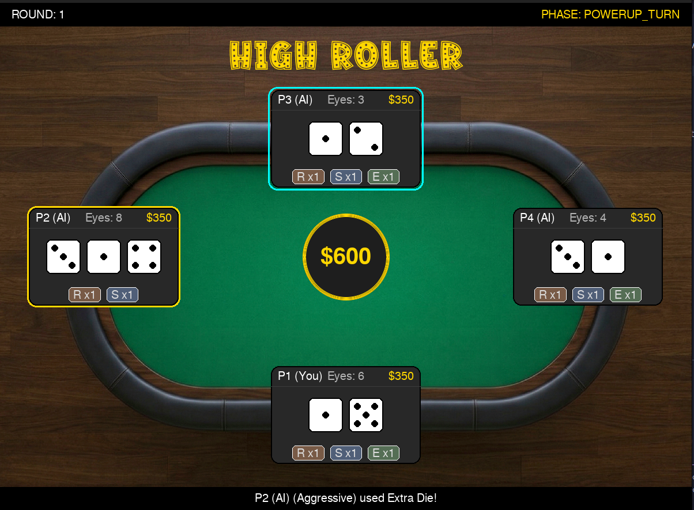

# 🎲 High Roller: Power Ups

**High Roller: Power Ups** is een tactisch dobbelspel voor vier spelers, gebouwd met Pygame. Het combineert de spanning van een casino met strategische elementen. Je neemt het op tegen drie AI-gestuurde tegenstanders, elk met een eigen persoonlijkheid, in een strijd om kapitaal en dominantie aan de tafel. Het spel bevat een volledig economisch systeem, een winkel voor power-ups en vloeiende animaties.


---

## 💻 Install & Run

Dit spel vereist Python 3 en de **pygame-ce** (Community Edition) library.

1.  **Installeer de benodigdheden**:
    Zorg dat je in de hoofdmap van het project bent en voer het volgende commando uit in je terminal:
    ```bash
    pip install -r requirements.txt
    ```

2.  **Start het spel**:
    Voer het hoofdprogramma uit met:
    ```bash
    python main.py
    ```

---

## 🕹 Play Instructions

Het doel is om na 10 rondes de meeste punten te hebben, of om als enige speler over te blijven terwijl de rest "Bust" gaat.

### Het Spelverloop
* **Initiative Phase**: Alle actieve spelers rollen een dobbelsteen om te bepalen wie de ronde mag starten. Bij een gelijkspel volgt een re-roll tussen de hoogste rollers.
* **Betting Phase**: De starter bepaalt de inzet voor de ronde. Deze inzet is beperkt door de "Table Cap" (het kapitaal van de armste speler) en een maximum van $150. Als menselijke speler gebruik je de **+** en **-** knoppen en bevestig je met **Confirm**.
* **Roll All**: Iedereen ontvangt twee willekeurige dobbelstenen. Let op de animaties waarbij de stenen om hun as draaien.
* **Power-up Turn**: Spelers mogen om de beurt (beginnend bij de starter) **maximaal één** power-up gebruiken:
    * **Reroll**: Gooi je eigen twee stenen opnieuw.
    * **Extra Die**: Voeg een derde dobbelsteen toe aan je totaal.
    * **Swap**: Ruil je laagste dobbelsteen met de hoogste van de huidige leider.
* **Showdown**: De speler met het hoogste totaal wint de pot. Bij een gelijkspel blijft de pot staan voor de volgende ronde.
* **Shop Phase**: Tussen de rondes door kun je in de shop nieuwe items kopen. **Let op**: Je moet altijd een reserve van minimaal $50 overhouden na aankoop.

### Belangrijke Functies voor de Grader
* **AI Persoonlijkheden**: Let op het gedrag van P2, P3 en P4. De **Aggressive** AI zet vaak de hoogste inzet, terwijl de **Defensive** AI zuinig omgaat met items.
* **Visual Feedback**: Panels van spelers die "Bust" zijn kleuren grijs en doen niet meer mee aan de inzet-rondes.
* **Audio**: Geniet van de achtergrondmuziek (*The Entertainer*) en de gesynchroniseerde dobbelsteen-geluidseffecten.

---

## 🎨 Design

Tijdens de ontwikkeling zijn de volgende keuzes gemaakt voor een professionele uitstraling:

* **State Machine**: De game logica is opgebouwd als een robuuste *State Machine* in de `Game` class, wat zorgt voor foutloze transities tussen gokken, spelen en shoppen.
* **UI/UX**: 
    * Gebruik van `gfxdraw` voor anti-aliasing op de centrale pot-cirkel en ronde knoppen om "pixelige" randen te voorkomen.
    * Een visueel grid-systeem in de player panels met headers voor naam, saldo en het totaal aantal ogen voor direct overzicht.
* **Animaties**: Dobbelstenen gebruiken een rotatie-algoritme dat rekening houdt met de middelpunt-offset om zwabberen tijdens het draaien te voorkomen.


---

## 👥 Authors
* **Eunchong** 
* **Indy** 
* **Jelle** 
* **Roman** 
* **Gemini** 
